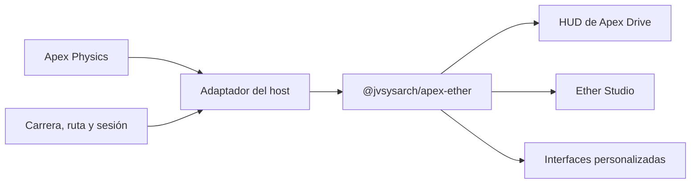

# Apex Ether

Sistema modular de HUD y telemetría automotriz creado por **Jonathan Villaverde**.

Apex Ether convierte datos de conducción en interfaces claras, configurables y eficientes. Nace como una pieza independiente dentro del ecosistema Apex: puede acompañar a Apex Drive, integrarse en otra experiencia React o servir como base para interfaces personalizadas sin quedar unido al ciclo de vida de una aplicación concreta.

> Estado actual: versión inicial en desarrollo. El catálogo, los componentes base, los contratos de telemetría y el modelo de actualización por segmentos ya están disponibles; la publicación del paquete y el compositor visual forman parte de las próximas etapas.

## Motivación

Un HUD automotriz tiene que resolver dos exigencias simultáneas: presentar mucha información sin competir con la conducción y reaccionar a telemetría de alta frecuencia sin trasladar cada actualización del simulador a toda la interfaz.

Apex Ether separa esas responsabilidades. El host conserva el control del motor, la sesión y las fuentes de datos; Ether recibe un contrato estable y se ocupa de la jerarquía visual, la accesibilidad, la composición de paneles y el costo de render.

## Problema que resuelve

| Problema | Respuesta de Apex Ether |
| --- | --- |
| El HUD queda acoplado a una aplicación o motor | Un paquete React público sin dependencias de Apex Drive ni del Studio |
| Una actualización de alta frecuencia invalida toda la interfaz | Suscripciones por segmentos de telemetría y paneles memorizados |
| Cada pantalla reconstruye títulos, métricas y listas | Primitivas reutilizables con estructura y tokens compartidos |
| Una única composición intenta servir a todos los contextos | Paneles independientes y un HUD declarativo configurable |
| La información pierde jerarquía sobre fondos variables | Modos Glass transparente y opaco blanco, tipografía amplia y señales semánticas consistentes |

## Integración con el ecosistema Apex



La integración tiene una sola dirección: las aplicaciones consumidoras conocen a Ether, pero Ether no conoce sus motores, escenas ni reglas de negocio. Un adaptador traduce la telemetría nativa al contrato público del paquete y publica sólo los segmentos que cambiaron.

La guía completa está en [Integración](docs/integration.md). Las decisiones y reglas de dependencia están en [Arquitectura](docs/architecture.md).

## Repositorio

```text
apex-ether/
├─ apps/
│  └─ apex-ether-studio/   catálogo, laboratorio y futuro compositor
├─ packages/
│  └─ apex-ether/          componentes, contratos, tokens y estilos
└─ docs/                   motivación, integración y arquitectura
```

- **`@jvsysarch/apex-ether`** es la biblioteca integrable.
- **Apex Ether Studio** es el espacio de exploración y validación visual.
- El futuro compositor vivirá en Studio y producirá configuraciones serializables basadas exclusivamente en la API pública del paquete.

## Rutas del Studio

- `/`: catálogo completo de componentes y composiciones.
- `/?lab=true`: catálogo con herramientas de tipografía, paleta, sombras y superficie.
- `/lab`: acceso alternativo al laboratorio.
- `/lab?section=typography`: laboratorio con Tipografía desplegada.
- `/?lang=es` y `/?lang=en`: catálogo completo en español o inglés. La selección ES/EN se conserva entre sesiones y puede combinarse con cualquier otra ruta, por ejemplo `/?lab=true&lang=en`.

## Desarrollo local

Requiere Node.js y Corepack.

```bash
corepack pnpm install
corepack pnpm dev
```

El Studio queda disponible en la dirección indicada por Vite. Para comprobar la versión de producción:

```bash
corepack pnpm build
corepack pnpm preview
```

## Modelo de rendimiento

- El estado de telemetría se divide en `motion`, `race`, `wheels`, `session` y `route`.
- Cada componente se suscribe únicamente al segmento que necesita mediante `useSyncExternalStore`.
- El host publica objetos inmutables sólo cuando su contenido cambia.
- Los paneles y primitivas exportados están memorizados para mantener el trabajo de React acotado.
- Las propiedades visuales viven en tokens CSS, evitando reconstruir estilos durante cada frame.

Estas medidas reducen renderizados innecesarios; no reemplazan el perfilado con datos reales del simulador. La metodología recomendada está documentada en [Arquitectura y rendimiento](docs/architecture.md#rendimiento).

## Publicación

El Studio está preparado para publicarse exclusivamente en **GitHub Pages**. El workflow de `.github/workflows/pages.yml` construye y despliega la rama `main`, configura la ruta base del repositorio y genera el fallback necesario para las rutas del laboratorio.

El paquete todavía es privado dentro del workspace. Hasta su primera distribución, los consumidores del monorepo deben declararlo con `workspace:*`.

## Documentación

- [Por qué existe Apex Ether](docs/motivation.md)
- [Cómo integrarlo](docs/integration.md)
- [Arquitectura y rendimiento](docs/architecture.md)
- [Referencia inicial del paquete](packages/apex-ether/README.md)

## Autoría

Diseño, dirección y desarrollo: **Jonathan Villaverde**  
Autor: [GitHub](https://github.com/jvsysarch) · [LinkedIn](https://ar.linkedin.com/in/jonathanvillaverde)  
Copyright © 2026 Jonathan Villaverde.

## Licencias

- Código fuente: PolyForm Noncommercial License 1.0.0.
- Diseño visual, imágenes y documentación: Creative Commons Attribution-NonCommercial-ShareAlike 4.0 International.

Consultá [LICENSE.md](LICENSE.md) para conocer el alcance y los archivos aplicables a cada licencia.
