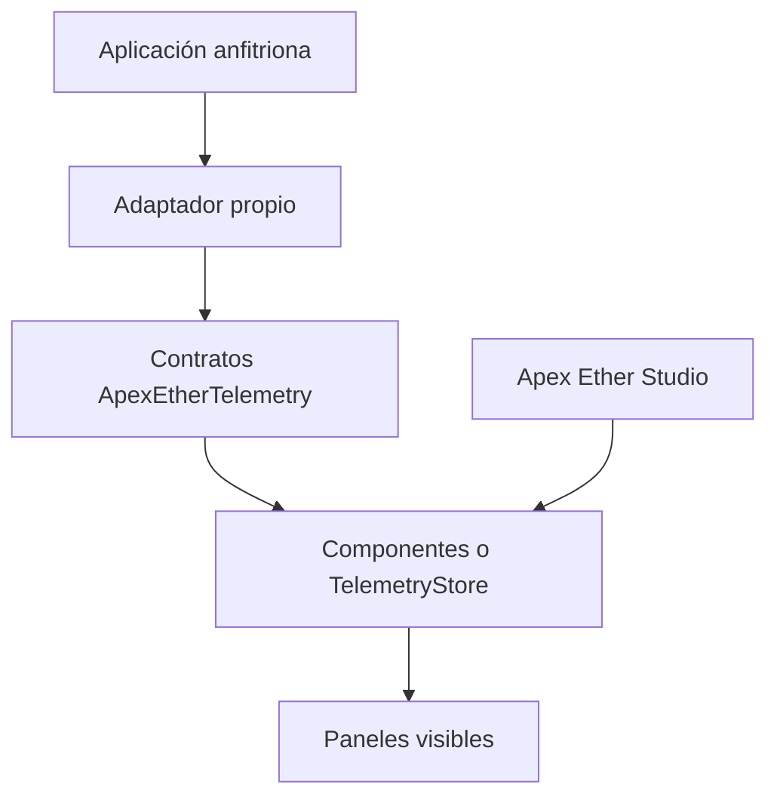

# Arquitectura y rendimiento

## Frontera del producto

Apex Ether no depende de la interfaz principal de Apex Drive. Su superficie pública de integración es `packages/apex-ether`; Studio es un consumidor de esa misma biblioteca.

## Reglas de dependencia

1. `packages/apex-ether` puede depender de React y de sus propios estilos.
2. `packages/apex-ether` no puede importar desde `apps/`, Apex Drive, el motor de física ni una fuente de telemetría concreta.
3. Studio puede importar la API pública de `packages/apex-ether`, nunca sus detalles internos.
4. El host es responsable de adaptar nombres, unidades y frecuencias externas.
5. Los componentes reciben propiedades serializables o segmentos del store público.

Estas reglas permiten probar el paquete con datos estáticos, integrarlo en distintos hosts y cambiar el productor de telemetría sin rediseñar los paneles.

## Capas

### Contratos

`ApexEtherTelemetry` divide el dominio inicial en:

- `motion`: velocidad, RPM, marcha y controles;
- `race`: posición, vueltas, tiempo, delta y sectores;
- `wheels`: temperatura, presión, carga y agarre por rueda;
- `session`: circuito, vehículo, modo, clima y condición;
- `route`: geometría opcional del trazado.

Los contratos expresan datos de presentación normalizados. No deben filtrar estructuras internas del motor.

### Store externo

`ApexEtherTelemetryStore` conserva cada segmento por separado. `useApexEtherSlice` se apoya en `useSyncExternalStore` para que un componente observe sólo el segmento que utiliza.

El store es una opción para telemetría continua. Las vistas estáticas o controladas también pueden pasar propiedades directamente a cada panel o utilizar `ApexEtherHud` con un snapshot completo.

### Primitivas visuales

`ApexEtherPanel`, `ApexEtherPanelHeader`, `ApexEtherPanelBody`, `ApexEtherPanelList`, `ApexEtherPanelRow`, `ApexEtherMetricGrid`, `ApexEtherMetric` y `ApexEtherProgress` forman el vocabulario base. Los paneles de dominio se construyen con esas primitivas para conservar estructura, accesibilidad y tokens.

### Studio

`apps/apex-ether-studio` contiene:

- catálogo de componentes y composiciones;
- modos Glass y opaco;
- laboratorio de tipografía, paleta, sombras y superficie;
- vistas conceptuales de telemetría;
- base para el futuro compositor visual.

Studio no es una dependencia de producción del HUD.

## Rendimiento

### Objetivo

El costo de una actualización debe ser proporcional al fragmento visible que cambió. Una nueva muestra de RPM no debería volver a renderizar clasificación, clima o sesión.

### Estrategia

- Crear una única instancia de `ApexEtherTelemetryStore` por HUD o contexto.
- Publicar segmentos inmutables y conservar la referencia cuando sus valores no cambien.
- No publicar directamente cada tick del motor si la pantalla no puede representar esa frecuencia; aplicar muestreo o agrupación en el adaptador.
- Separar datos rápidos (`motion`) de datos lentos (`session`, `route`).
- Mantener cálculos pesados y transformaciones fuera del render.
- Animar propiedades que el navegador pueda componer eficientemente y evitar reconstruir estilos globales por frame.
- Montar únicamente los paneles necesarios para la composición activa.

### Responsabilidad del host

Ether evita trabajo React innecesario, pero el host controla la cadencia de entrada. El adaptador debe comparar, normalizar y publicar. Para una integración real se recomienda medir:

- frecuencia de muestras recibidas y publicadas;
- cantidad de commits React por segmento;
- tiempo de render de los paneles visibles;
- estabilidad de frame con Glass activo;
- consumo en la resolución y escala objetivo.

Los efectos de `backdrop-filter` dependen del navegador, la GPU, el área cubierta y la escena subyacente. El nivel de blur es un token configurable y debe validarse en el hardware objetivo.

## Futuro compositor de interfaces

El editor vivirá en Studio y trabajará sobre un esquema serializable. Ese esquema podrá seleccionar componentes públicos, propiedades, modo de superficie y ubicación. No contendrá componentes React arbitrarios ni creará una dependencia inversa desde la biblioteca hacia el editor.

Un esquema futuro debería incluir al menos:

- versión del formato;
- identificador y variante de cada panel;
- fuente de datos requerida;
- posición y restricciones responsivas;
- modo Glass u opaco;
- tokens permitidos y reglas de visibilidad.

## API pública y compatibilidad

Sólo las exportaciones del punto de entrada `@jvsysarch/apex-ether` y `@jvsysarch/apex-ether/styles.css` se consideran públicas. Los consumidores no deben importar archivos internos. Antes de la versión `1.0.0`, los cambios incompatibles se documentarán en cada release.
